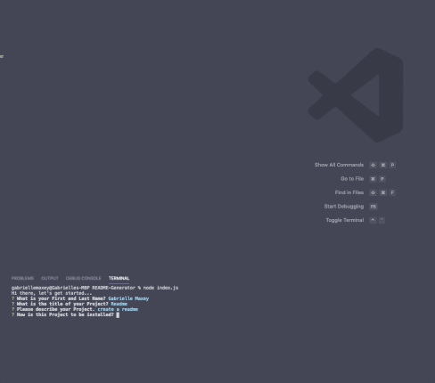

  

  # CLI based README Generator

  ## Description
 This application will create a README.md file that will include sections for Title, Description, Installation, Usage, Tests, Author, Licensing, How to Contribute, and Questions. It will also include a Table of Contents and contact information.

  

[See the full video of application in use](https://drive.google.com/file/d/15_vrtqP_z9FuCd5DHMM7WNty029SOLcC/view)

  ## Table of Contents
  * [Description](#Description)
  * [Installation](#Installation)
  * [Usage](#Usage)
  * [Contributing](#Contributing)
  * [Tests](#Tests)
  * [Questions](#Questions)
  * [Author](#Author)
  * [License](#License)

  ## Installation
  This application is installed via node.js with npm dependency.

  ## Usage
  Once you've forked the repository and cloned into your personal directory, you'll install the necessary dependencies and run with node.js. This application will then prompt you through a series of questions to complete the README file.

  ## Contributing
  If you'd like to expand upon this application, please fork the repository and code away. You may also reach out to me directly if you wish to collaborate.

  ## Tests
  To test the code, you can run via VScode or any other coding platform.

  ## Questions
  Please send any questions or comments to the author listed below.

  ## Author:
  Gabrielle Maxey

  Email: gmaxeyg@gmail.com

  Github: <https://github.com/GabrielleM45>

  ## License
  *This application is Licensed under the following license:*\
  **[mit](https://choosealicense.com/licenses/mit/)**

